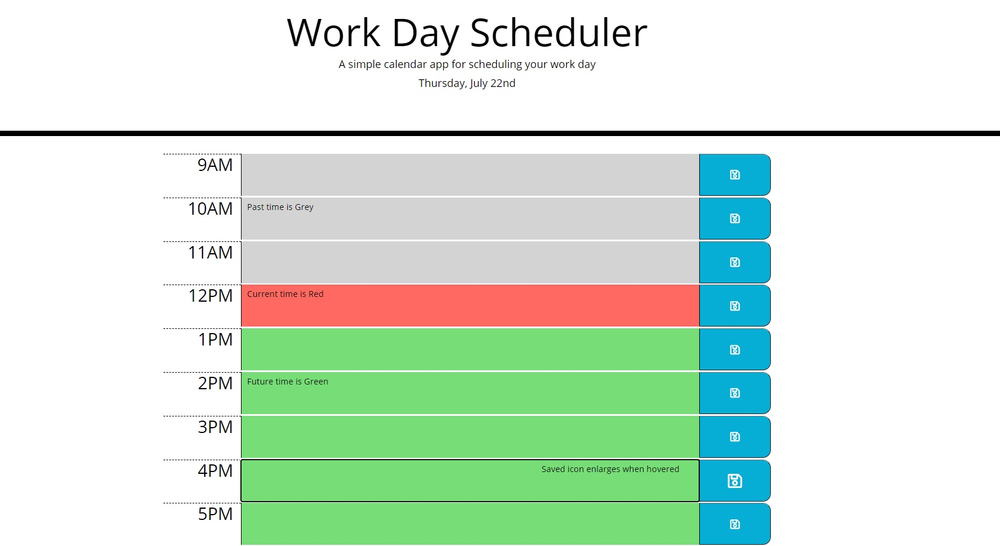

# Planner
This will generate and display the eight hour shift in a work day. Displaying the current time in Red, past time in Grey, and time left in the day as Green. Hovering over saved icons will enlarge them, and when pressed the text in the row will be saved to localStorage.

## Goal
Practice saving data to localStorage, creating elements, and using 3rd party APIs.

## Built with
* HTML
* CSS
* JavaScript
* JQuery
* Moment
* Bootstrap
* fontawesome

## Website
https://mtastalos.github.io/Planner/

 

 ## Contribution
 Made By Michael Astalos 
